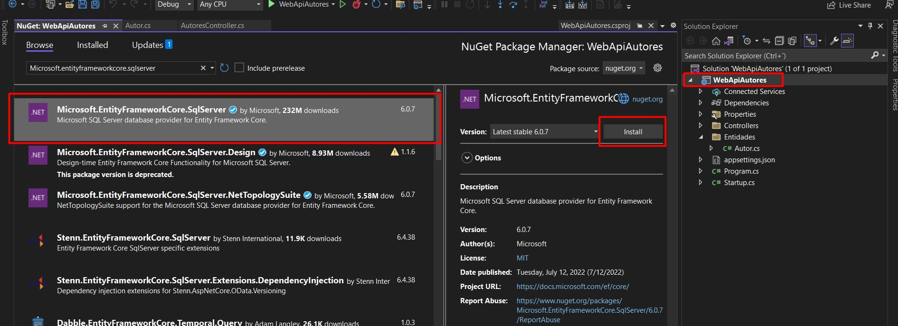
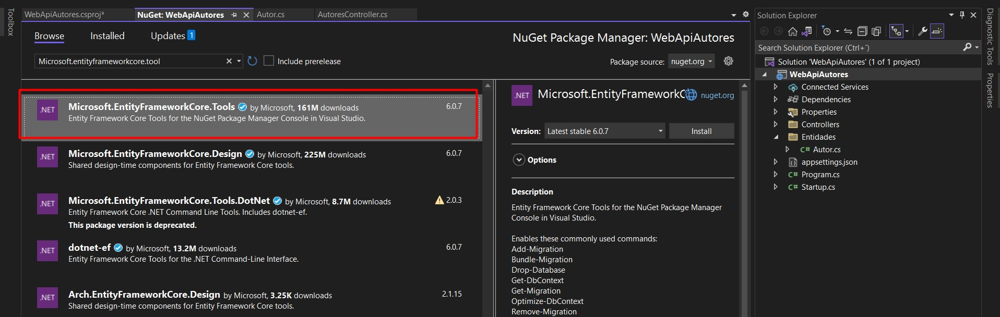
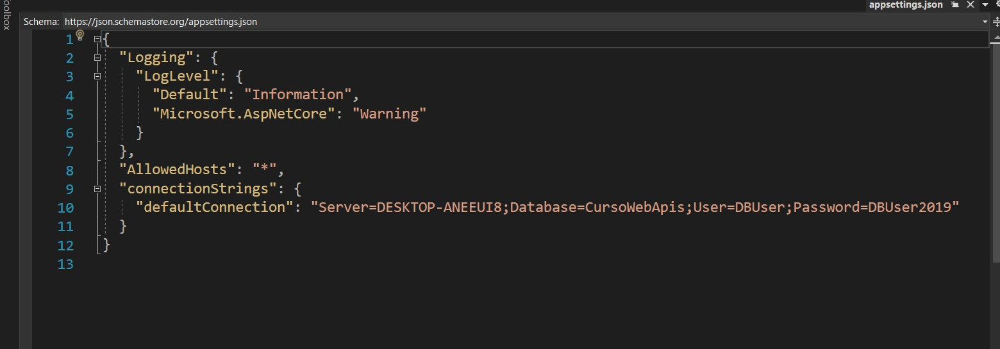
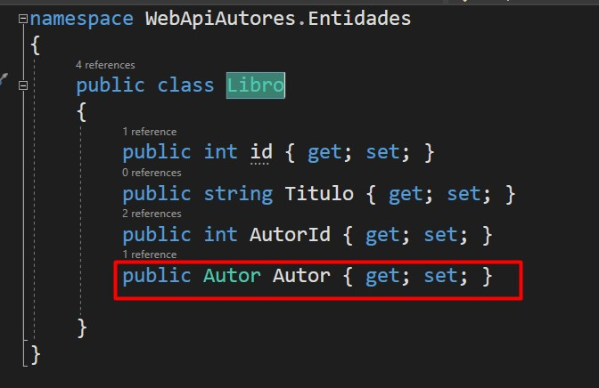
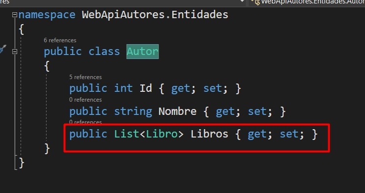
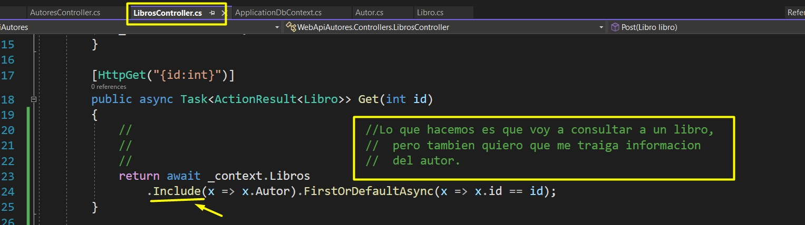
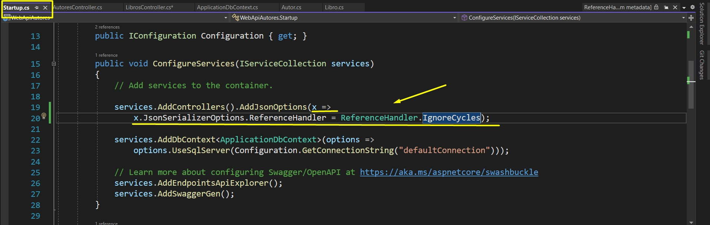
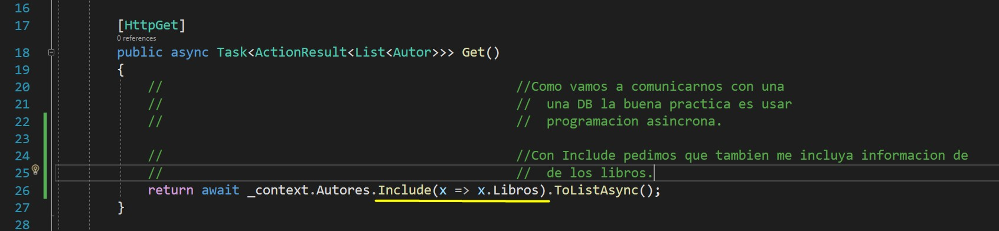

# webapiautores

## Instalamos los Paquetes de ORM Y TOOLS para usar EntityFramework.

### Agregamos los string de conecciones.
Estas conecciones se agregan en el appsetting ya que puede darse 
el caso de que yo quiero utilizar una cadena de coneccion 
para development y otra cadena de coneccion para produccion ya 
que van a estar apuntando a diferentes bases de datos y es por
eso que no es recomendable agregarlos en el codigo.

### Pasos para generar nuestra DB a partir de las Entitys.

*   > - `Add-Migration Inicial` 
    > - Desde cmd `dotnet ef migrations add nameCustom`
*   > `Update-Database`
    > Desde cmd `dotnet ef database update`

# 22 Leyendo y Creando Recursos desde el Controlador

**NOTA** Como buena practica siempre que vamos a comunicarnos
con una DB, hay que utilizar programacion asincrona.

# 24 Data Relacionada - Segundo Controlador

Tablas de las entitys

Entity Libro.- Libro va a tener una llave foranea Autor

Entity Autor.- En este caso no tiene llave foranea pero tiene
una lista de libros para posteriomente utilizar el include
para traer todos los libros de un Autor.

**Si hacemos esta consulta haciendo uso del include** 
va a tronar ya que Autor tiene una lista de entitys Libros.

Entonces lo que hace `Include` es que a todas las clases entitys
que tenga adentro entitys, les saca la informacion, pero en este 
caso se hace un ciclo ya que la entity Libro tiene a la entity
Autor y este a su ves tiene una lista de entity de Libros,
entonces se hace un ciclo infinito.

> Entonces para resolver este caso hay que poner la siguiente
instruccion en el startup para los controllers para que no se cicle.

Ahora vamos a traer todos los libros del Author.

