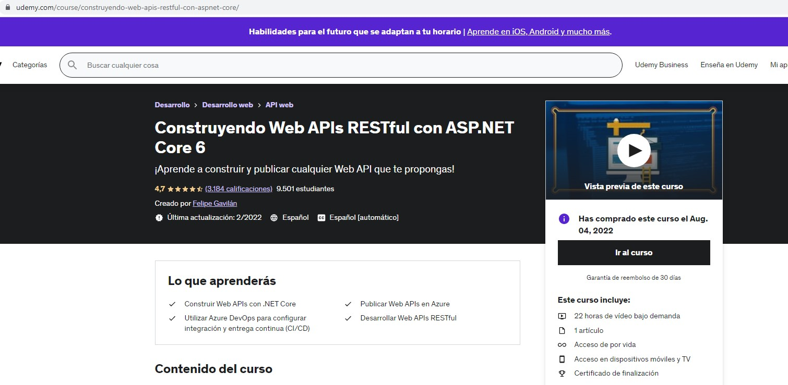
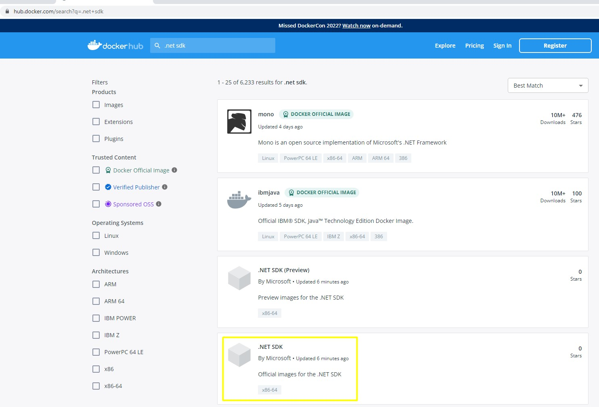
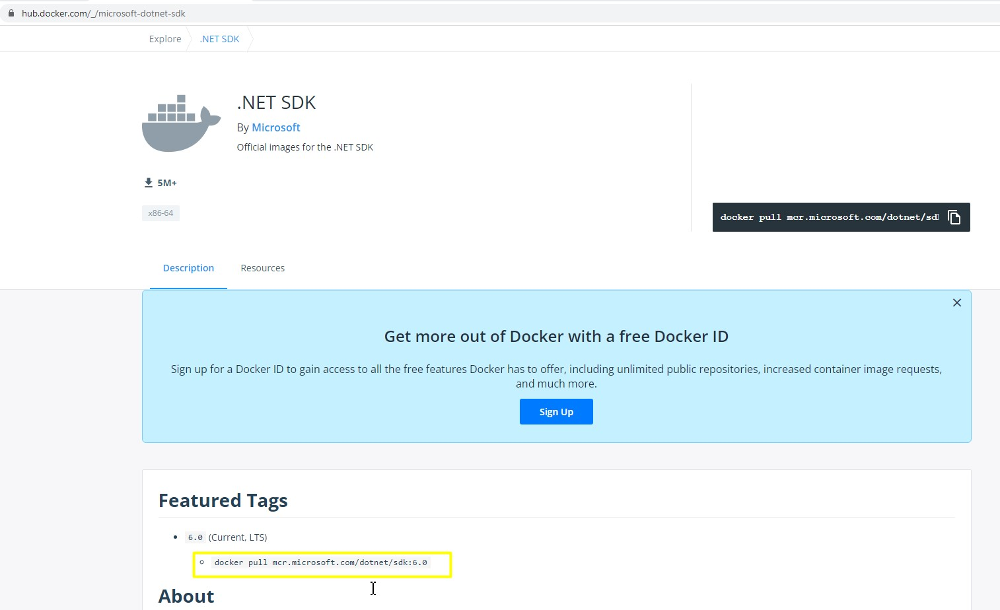

# SECCION 2 y 3 del curso UdemyCurso 


https://www.udemy.com/course/construyendo-web-apis-restful-con-aspnet-core/

# webapiautores


## Instalamos los Paquetes de ORM Y TOOLS para usar EntityFramework.


### Agregamos los string de conecciones.
Estas conecciones se agregan en el appsetting ya que puede darse 
el caso de que yo quiero utilizar una cadena de coneccion 
para development y otra cadena de coneccion para produccion ya 
que van a estar apuntando a diferentes bases de datos y es por
eso que no es recomendable agregarlos en el codigo.


### Pasos para generar nuestra DB a partir de las Entitys.

*   > - `Add-Migration Inicial` 
    > - Desde cmd `dotnet ef migrations add nameCustom`
*   > `Update-Database`
    > Desde cmd `dotnet ef database update`

# 22 Leyendo y Creando Recursos desde el Controlador

**NOTA** Como buena practica siempre que vamos a comunicarnos
con una DB, hay que utilizar programacion asincrona.

# 24 Data Relacionada - Segundo Controlador

Tablas de las entitys

Entity Libro.- Libro va a tener una llave foranea Autor


Entity Autor.- En este caso no tiene llave foranea pero tiene
una lista de libros para posteriomente utilizar el include
para traer todos los libros de un Autor.


**Si hacemos esta consulta haciendo uso del include** 
va a tronar ya que Autor tiene una lista de entitys Libros.


Entonces lo que hace `Include` es que a todas las clases entitys
que tenga adentro entitys, les saca la informacion, pero en este 
caso se hace un ciclo ya que la entity Libro tiene a la entity
Autor y este a su ves tiene una lista de entity de Libros,
entonces se hace un ciclo infinito.

> Entonces para resolver este caso hay que poner la siguiente
instruccion en el startup para los controllers para que no se cicle.


Ahora vamos a traer todos los libros del Author.


# Vamos a hacer la publicacion y corrida de la aplicacion de manera manual

Abrimos CMD y nos ubicamos en el lugar en donde esta
el proyecto y corremos cada comando

### **instalamos todas las dependecias**
dotnet restore

### **Hacemos la publicacion del proyecto**
dotnet publish -c Release -o out

### **Corremos la aplicacion a traves de .dll**
dotnet out/name.dll

Nota. El Dockerfile siempre debe de estar en donde
esta el archivo del proyecto

## Para empezar con Docker

Lo primero que vamos a hacer es descargar la imagen oficial
del sdk de .net desde el hub de docker



Ahora si no aparece una version pasada es porque no hay soporte
y por lo tanto la aplicacion se tiene que actualizar.

Entonces copiamos 



docker build -t dotnetcoreapp .

```docker

# Decimos que vallamos a buscar la imagen y lo utilizamos aqui con
# el nombre de build
FROM mcr.microsoft.com/dotnet/sdk:6.0 as build

# Este es el nombre que le voy a dar a mi contenedor.
WORKDIR webapp 

# Ponemos el puerto para ir hacia la aplicacion.
EXPOSE 80
EXPOSE 5024

# Copiamos los archivos del proyecto.
# ./ nos ubicamos en el directorio que estamos y lo copiamos al mismo lugar 
# donde estamos dentro del contenedor de docker.

COPY ./*.csproj ./

# Verificamos que el archivo del proyecto tenga todas las dependencias. 
RUN dotnet restore 

#Copiar todo el resto hacia dentro del contenedor de docker.
COPY . .

# aqui estamos obteniendo los artefactos que docker va a necesitar para ejecutar nuestra aplicacion.
RUN dotnet publish -c Release -o out

# Build Image - Construimos la imagen.
FROM mcr.microsoft.com/dotnet/sdk:6.0
WORKDIR /webapp
COPY --from=build /webapp/out .

# Especificamos cual es el ejecutable
ENTRYPOINT ["dotnet", "/WebApiAutores.dll"]
```

docker build -t dotnetcoreapp .
https://www.youtube.com/watch?v=8WO-WlZ9NoA